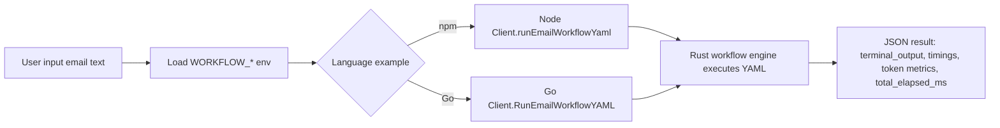

# Workflow Email Examples

This folder contains an LLM-driven email intake classification demo in both Python and YAML forms.

Primary workflow file:

- `email-unified-chat-intake-classification.yaml` (recommended: chat + classification + RAG + drafting)
- `email-intake-classification.yaml`
- `email-chat-draft-or-clarify.yaml` (chat history input; drafts or asks follow-up)
- `python-intern-fun-interview-system.yaml` (sophisticated Python intern vetting flow)

## Files

- `python_email_workflow_demo.py`: direct Python implementation (LLM + mock RAG routing)
- `run_yaml.py`: lightweight runner script (optional convenience)
- `run_with_chat_history.py`: workflow_input/messages example (draft vs ask-scenario)
- `run_with_unified_system.py`: separate unified system (chat + classification + RAG + draft)
- `handlers.py`: real Python custom worker handlers (e.g. `GetRagData`)
- `python/`: Python run docs
- `node/`: Node/npm run docs (`npm_email_workflow_example.js`)
- `go/`: Go run docs (uses `bindings/go/examples/workflow_email/main.go`)

## Implementation Plan

1. Reuse existing workflow YAML files so behavior remains consistent across languages.
2. Add a minimal npm example (`node/npm_email_workflow_example.js`) that maps workflow env vars and runs `runEmailWorkflowYaml`.
3. Add a minimal Go example (`bindings/go/examples/workflow_email/main.go`) that maps workflow env vars and runs `RunEmailWorkflowYAML`.
4. Update language-specific docs (`node/README.md`, `go/README.md`) and this top-level README with run commands.
5. Keep advanced custom-worker examples available separately for deeper integration demos.



## Prerequisites

Create `examples/.env` (or export env vars) with:

- `WORKFLOW_PROVIDER` (optional, default: `openai`)
- `WORKFLOW_API_BASE`
- `WORKFLOW_API_KEY`
- `WORKFLOW_MODEL`

Backward-compatible fallback env names are also supported:

- `CUSTOM_API_BASE`
- `CUSTOM_API_KEY`
- `CUSTOM_API_MODEL`

## Environment

Use these provider-agnostic env vars in `examples/.env`:

- `WORKFLOW_PROVIDER` (optional, default: `openai`)
- `WORKFLOW_API_BASE`
- `WORKFLOW_API_KEY`
- `WORKFLOW_MODEL`

Legacy fallback vars still work:

- `CUSTOM_API_BASE`
- `CUSTOM_API_KEY`
- `CUSTOM_API_MODEL`

## Python (package API)

Use the package directly (recommended):

```python
from simple_agents_py import Client

client = Client("openai", api_base="...", api_key="...")
result = client.run_email_workflow_yaml(
    "examples/workflow_email/email-intake-classification.yaml",
    "Termination request, second warning already issued",
)
print(result["terminal_output"])
print(result["step_timings"])
print(result["total_elapsed_ms"])
```

Chat-history workflow input example (`messages` list of typed message objects):

```python
result = client.run_workflow_yaml(
    "examples/workflow_email/email-unified-chat-intake-classification.yaml",
    {
        "email_text": "Conversation-driven workflow input",
        "messages": [
            {"role": "system", "content": "You are an assistant helping draft professional emails."},
            {"role": "user", "content": "Please draft a response for damaged order #9921 and offer expedited replacement."},
        ],
    },
)
```

Ready-to-run helper file:

```bash
uv run --directory examples python workflow_email/run_with_python_package.py
```

Non-streaming with collected events (including `node_llm_input_resolved` metadata):

```bash
uv run --directory examples python workflow_email/run_with_python_package.py --include-events
```

Live workflow event streaming (step events + LLM deltas when streamable):

```bash
uv run --directory examples python workflow_email/run_with_python_streaming.py \
  --workflow examples/workflow_email/email-intake-classification.yaml \
  --email "Termination request, second warning already issued"
```

Run the dedicated interactive chat-history example:

```bash
uv run --directory examples python workflow_email/run_with_chat_history.py

# Make target equivalent:
make run-python-chat-history
```

Node equivalent:

```bash
make run-node-chat-history

# Optional: run with bun runtime
make run-node-chat-history JS_RUNTIME=bun

# Optional: pick a workflow YAML
make run-node-chat-history WORKFLOW_YAML=examples/workflow_email/python-intern-fun-interview-system.yaml

# Optional parity flags: --include-events --stream --show-thinking --show-step-json
make run-node-chat-history NODE_CHAT_FLAGS="--include-events --stream --show-thinking --show-step-json"
```

Go equivalent:

```bash
WORKFLOW_PROVIDER=openai \
WORKFLOW_API_BASE=https://api.openai.com/v1 \
WORKFLOW_API_KEY=your_key_here \
make run-go-chat-history

# Optional: pick a workflow YAML
make run-go-chat-history WORKFLOW_YAML=examples/workflow_email/python-intern-fun-interview-system.yaml

# Optional parity flags: --include-events --stream --show-thinking --show-step-json
make run-go-chat-history GO_CHAT_FLAGS="--include-events --stream --show-thinking --show-step-json"
```

Cross-language parity check (same YAML, same flags):

```bash
make run-python-chat-history \
  WORKFLOW_YAML=examples/workflow_email/email-chat-draft-or-clarify.yaml \
  PY_CHAT_FLAGS="--include-events --stream --show-thinking --show-step-json"

make run-go-chat-history \
  WORKFLOW_YAML=examples/workflow_email/email-chat-draft-or-clarify.yaml \
  GO_CHAT_FLAGS="--include-events --stream --show-thinking --show-step-json"
```

Run the separate unified system:

```bash
uv run --directory examples python workflow_email/run_with_unified_system.py
```

Run the interview vetting system with the chat runner:

```bash
uv run --directory examples python workflow_email/run_with_chat_history.py \
  --workflow examples/workflow_email/python-intern-fun-interview-system.yaml
```

Note: this interview workflow locks the current chat session after termination.
Once terminated, the same session cannot continue; start a new run for a new candidate.

Persist traces to a custom directory:

```bash
uv run --directory examples python workflow_email/run_with_chat_history.py --trace-dir examples/workflow_email/traces
```

The chat loop will:

- explain capabilities for first-time users who ask "what can you do?"
- ask a follow-up scenario question when details are missing
- draft an email when scenario details are sufficient
- keep conversation history in `workflow_input.messages`

Trace files are written as JSONL (`chat-session-<timestamp>.jsonl`) with per-turn workflow trace, timing, terminal output, and optional events.

YAML `llm_call` supports:

- `stream: true` to enable token delta events for that node
- `heal: true` to enable healing mode (non-streamable for that node)
- `config.output_schema` (recommended) to define structured JSON output contract per node

YAML nodes also support memory interpolation via globals:

- `config.set_globals` can promote values into `globals.*`
- `config.update_globals` supports mutable updates:
  - `op: set`
  - `op: append`
  - `op: increment`
  - `op: merge`
- downstream prompts can read:
  - `{{ globals.some_key }}`
  - `{{ nodes.some_node.output.some_field }}`
  - `{{ input.email_text }}`

When `stream=true` and `heal=true` together, runtime emits a `node_streaming_unavailable` event with explanatory text and runs non-streaming with healing.

For telemetry/analytics, runtime also emits `node_llm_input_resolved` before each `llm_call`, including resolved prompt inputs and template binding source paths in `event.metadata`.

`run_with_python_package.py` now executes `custom_worker.handler` through `workflow_email/handlers.py` (for `GetRagData`) via the Rust-backed package API.

## Python (script)

```bash
uv run --directory examples python workflow_email/python_email_workflow_demo.py
```

## YAML runner script (optional)

```bash
uv run --directory examples python workflow_email/run_yaml.py email-intake-classification.yaml
```

Pass a custom email inline:

```bash
uv run --directory examples python workflow_email/run_yaml.py email-intake-classification.yaml --email "Termination request, second warning already issued"
```

`custom_worker.handler: GetRagData` is executed by the real Python function `handlers.get_rag_data(...)` in `examples/workflow_email/handlers.py`.

## Node.js / TypeScript (package API)

Use `simple-agents-node` and call the new method:

```ts
import { Client } from "simple-agents-node"

const client = new Client("openai")
const result = client.runEmailWorkflowYaml(
  "examples/workflow_email/email-intake-classification.yaml",
  "Please process supply chain replacement, order 9921 arrived damaged."
)

console.log(result.terminal_output)
console.log(result.step_timings)
console.log(result.total_elapsed_ms)
```

Ready-to-run helper file:

```bash
npm --prefix crates/simple-agents-napi run build:debug
node examples/workflow_email/node/npm_email_workflow_example.js
```

Custom-worker bridge demo (executes real JavaScript handlers for `custom_worker` nodes):

```bash
node examples/workflow_email/run_with_node_package.js
```

## Go (package API)

Use the Go binding and call `RunEmailWorkflowYAML`:

```go
ctx := context.Background()
client, err := simpleagents.NewClientFromEnv("openai")
if err != nil {
    panic(err)
}
defer client.Close()

out, err := client.RunEmailWorkflowYAML(
    ctx,
    "examples/workflow_email/email-intake-classification.yaml",
    "Termination request, second warning already issued",
)
if err != nil {
    panic(err)
}

fmt.Println(out.TerminalOutput)
fmt.Println(out.StepTimings)
fmt.Println(out.TotalElapsedMS)
```

Ready-to-run helper file:

```bash
cargo build -p simple-agents-ffi --release
CGO_CFLAGS="-I$PWD/crates/simple-agents-ffi/include" \
CGO_LDFLAGS="-L$PWD/target/release" \
LD_LIBRARY_PATH="$PWD/target/release:${LD_LIBRARY_PATH:-}" \
go run ./bindings/go/examples/workflow_email
```

When running locally in this repo, ensure FFI library is built and linker flags are set:

```bash
cargo build -p simple-agents-ffi --release
CGO_CFLAGS="-I$PWD/crates/simple-agents-ffi/include" \
CGO_LDFLAGS="-L$PWD/target/release" \
LD_LIBRARY_PATH="$PWD/target/release:${LD_LIBRARY_PATH:-}" \
go test ./...
```
